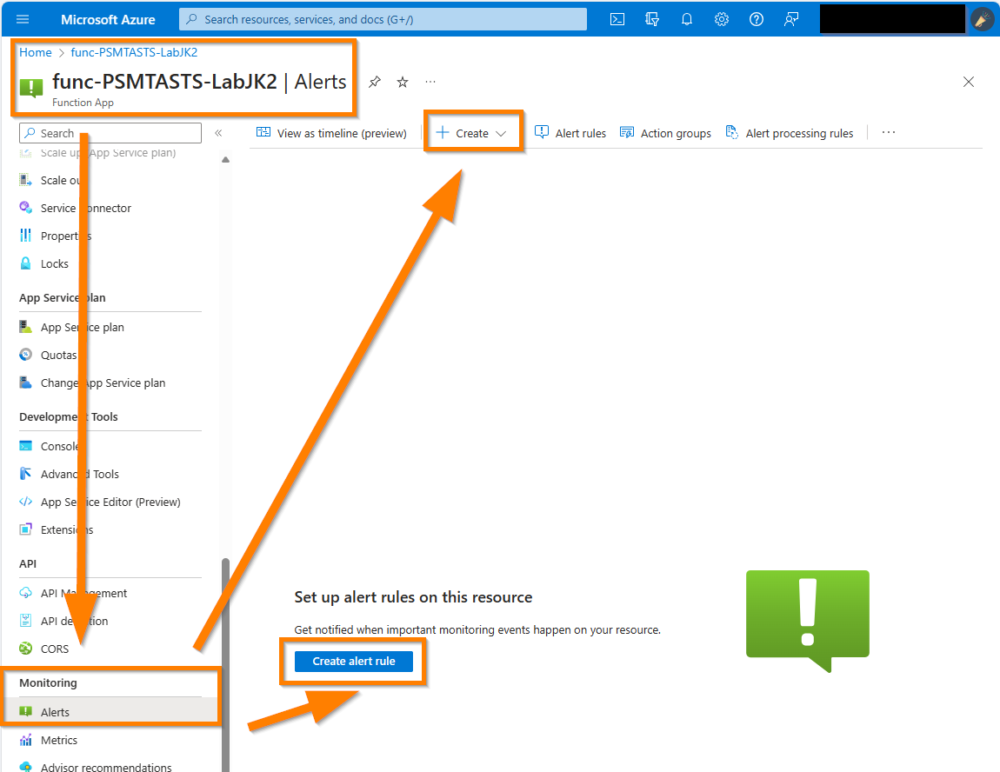
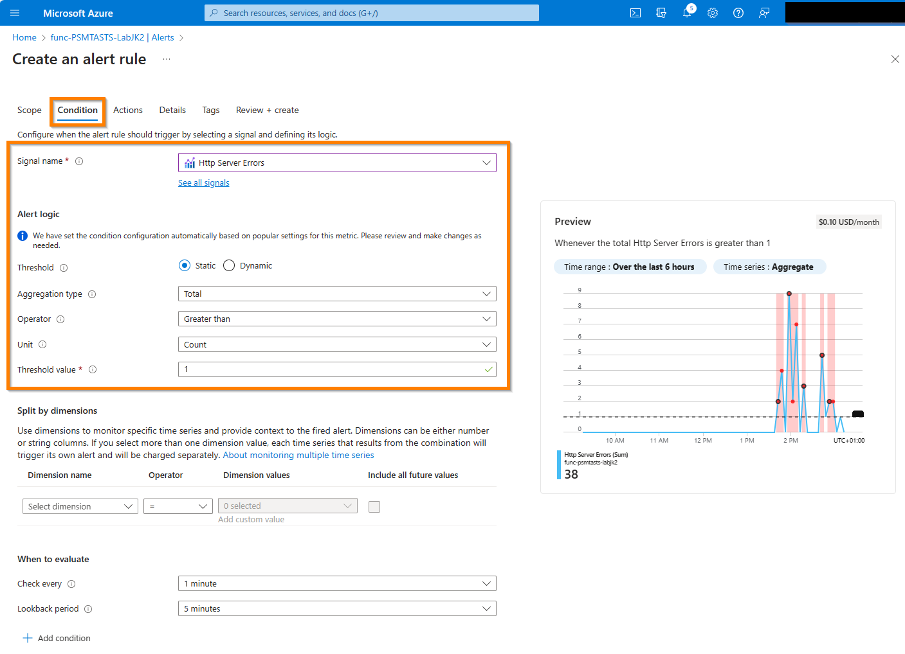
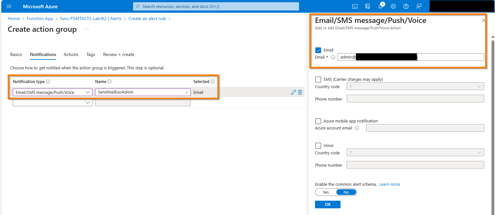
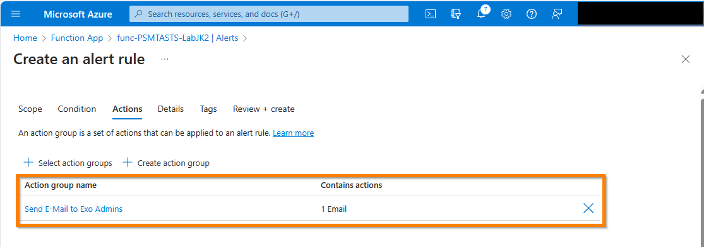
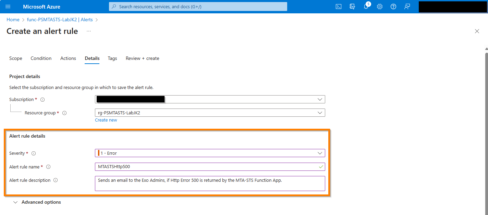
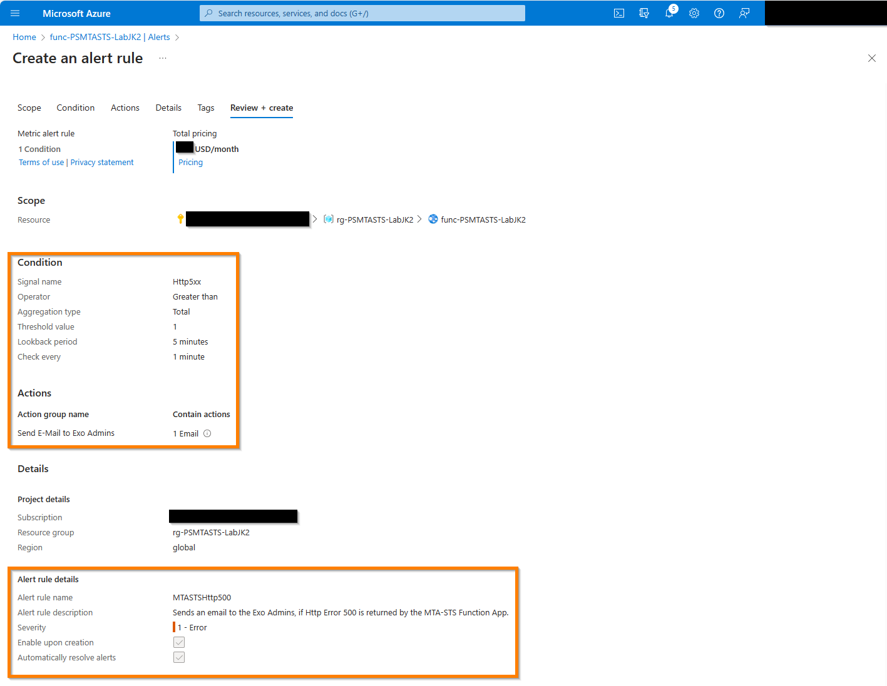
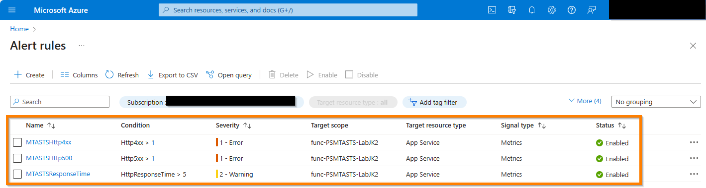

# Configuring Alert Rules for Azure Function App

This guide will walk you through the process of configuring alert rules for an Azure Function App. These alert rules will help you monitor the health state of your function app, which is used to publish the MTA-STS policy file through HTTPS.

## Prerequisites

Before you begin, make sure you have the following:

- An Azure subscription
- An Azure Function App created to publish the MTA-STS policy file through HTTPS as described in [Deploy MTA-STS using a Azure Function App](./deployFunctionApp.md)

## Step 1: Sign in to the Azure portal

1. Open a web browser and navigate to the [Azure portal](https://portal.azure.com).
2. Sign in with your Azure account credentials.

## Step 2: Navigate to your Function App

1. In the Azure portal, search for and select "Function Apps" in the search bar.
2. Select your Function App from the list.

## Step 3: Configure Alert Rules

1. In the Function App's overview page, click on "Alerts" in the left-hand menu.
2. Click on "Create alert rule" to create a new alert rule.

    

## Step 4: Define the Alert Condition

1. In the "Create rule" page, provide a name for the alert rule.
2. Select the appropriate resource group and resource type for your Function App.
3. Under "Condition", create a single condition by choosing the metric you want to monitor.

    > **NOTE** To use multiple conditions create a new alert rule for each condition. If you define multiple conditions in a single alert rule, all conditions must be met for the alert to be triggered.

    Here are some examples for a function app that publishes text through HTTPS:

    - **Example 1: HTTP Server Errors**
    - This condition monitors the number of HTTP Server errors returned by the function app.
    - To configure this condition, select "HTTP Server errors" as the metric.
    - Set the threshold and duration based on your desired criteria or use the default values.

    - **Example 2: HTTP 4xx**
    - This condition monitors the number of HTTP 4xx errors returned by the function app. This includes Error 403 ('Web App is stopped')
    - To configure this condition, select "HTTP Server errors" as the metric.
    - Set the threshold and duration based on your desired criteria or use the default values.

    - **Example 3: Response Time**
    - This condition monitors the execution time of the function app.
    - To configure this condition, select "Response Time" as the metric.
    - Set the threshold and duration based on your desired criteria or use the default values.

4. Configure any additional conditions or actions as needed.

    

## Step 5: Configure the Alert Action

1. Under "Actions", click on "Create action group" to configure the alert action or select an existing action group if you have one.
2. If you are creating a new action group, provide a name for the action group and select the appropriate notification type (e.g. send an email).
3. Configure the necessary details for the selected action type.

    

4. Click on "OK" to save the action group.

    

## Step 6: Configure Details for the Alert Rule

1. Under "Details", provide a name for the alert rule.
2. Optionally, provide a description for the alert rule.
3. Configure the severity and frequency of the alert rule.

    

## Step 7: Review and Create the Alert Rule

1. Review the alert rule settings to ensure they are correct.
2. Click on "Create alert rule" to create the alert rule.

    

## Step 8: Create more alert rules

1. Repeat the steps 3 to 7 to create more alert rules for your function app as needed.

    > **NOTE** It is recommended to create alert rules for different conditions such as HTTP 5xx errors, HTTP 4xx errors, response time, etc. to ensure comprehensive monitoring of your function app.

    

## Step 9: Test the Alert Rule

1. Trigger the condition that should trigger the alert (e.g., intentionally cause an HTTP 5xx error, shutdown the function app, etc.)
2. Check your configured action (e.g., email) to verify that the alert was triggered and received.

CONGRATULATIONS! You have successfully configured alert rules for your Azure Function App.

## optional: Step 10: Use KQL query manually to check logs for issues

Additionally, you can use Kusto Query Language (KQL) to query the logs of your function app to check for any issues or errors.
To do this, navigate to the "Logs" section of your function app in the Azure portal and use the KQL queries to filter and analyze the logs.
Here are some examples of KQL queries that you can use to monitor the health state of your function app:

```kql
// Query to check for HTTP 5xx errors
requests
| where timestamp > ago(1h)
| where resultCode != 200
| project timestamp, operation_Name, resultCode, url

// Query to check for latency issues
requests
| where timestamp > ago(1h)
| where duration > 5000
| project timestamp, operation_Name, duration, url

// Graph to visualize the number of requests over time
requests
| summarize count() by bin(timestamp, 1m)
| render timechart
```

## Conclusion

In this guide, you learned how to configure alert rules for an Azure Function App to monitor the health state of your function app. By setting up these alert rules, you can proactively detect and respond to any issues that may arise.

Please note that the examples provided in this guide are just a starting point, and you can customize the alert rules based on your specific requirements and use cases.

We are looking forward to your feedback. If you have any questions or suggestions, please feel free to open an issue in the [PS.MTA-STS GitHub repository](https://github.com/jklotzsche-msft/PS.MTA-STS/issues).
