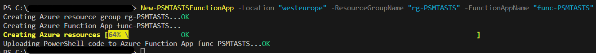
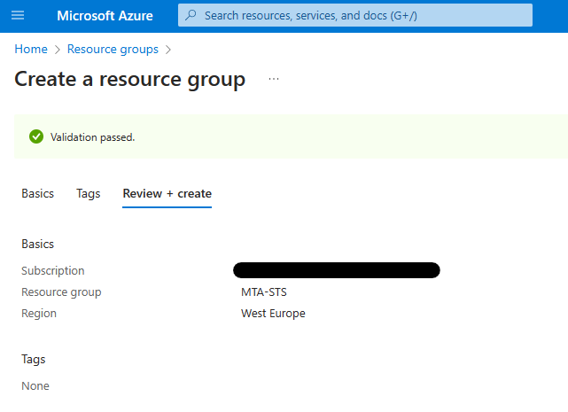
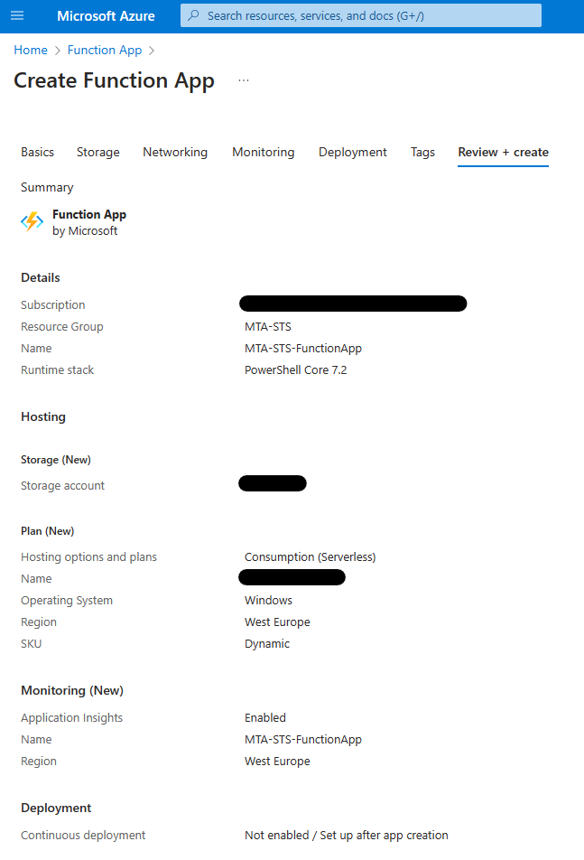
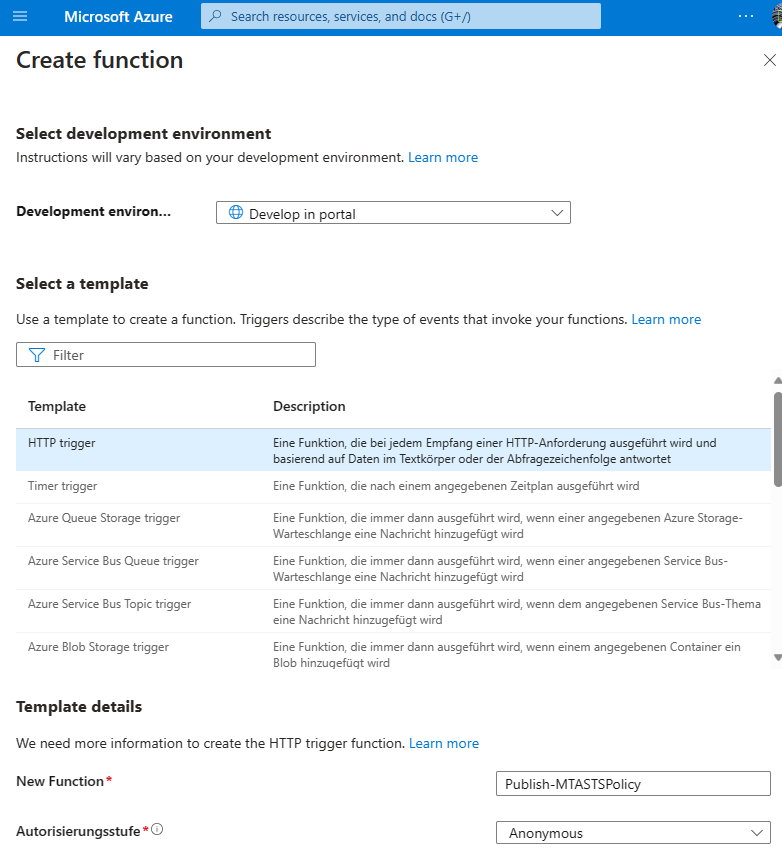
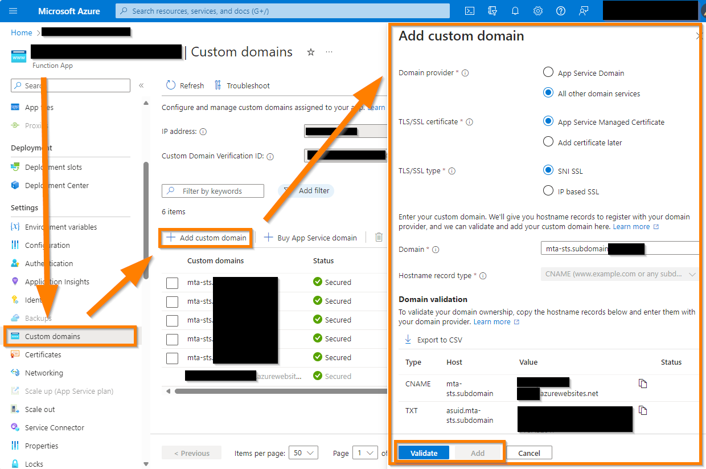

# Deploy MTA-STS using a Azure Function App

This guide will help you to deploy MTA-STS for your domain(s) using a Azure Function App. If you want to deploy MTA-STS using a Azure Static Web App, check out [the original deployment guide](https://learn.microsoft.com/en-us/microsoft-365/compliance/enhancing-mail-flow-with-mta-sts?view=o365-worldwide#option-1-recommended-azure-static-web-app).<br>
> **NOTE** Please remember, that you can only add [5 custom domains per Azure Static Web App](https://learn.microsoft.com/en-us/azure/static-web-apps/plans#features), while you can add [500 custom domains per Azure Function App](https://learn.microsoft.com/en-us/azure/azure-functions/functions-scale#service-limits). So if you want to configure MTA-STS for more than 5 domains, it is highly recommended to use a Azure Function App.

## Table of Contents

- [Prerequisites](#prerequisites)
- [Terminology](#terminology)
- [Deployment](#deployment)
  - [Step 1: Create list of domains to deploy MTA-STS for](#step-1-create-list-of-domains-to-deploy-mta-sts-for)
  - [Step 2: Create Azure Function App](#step-2-create-azure-function-app)
    - [Step 2.1: Create Azure resources automatically](#step-21-create-azure-resources-automatically)
    - [Step 2.2: Create Azure resources manually](#step-22-create-azure-resources-manually)
  - [Step 3: Create CNAME and TXT records in public DNS for your domains](#step-3-create-cname-and-txt-records-in-public-dns-for-your-domains)
  - [Step 4: Add custom domains to Azure Function App](#step-4-add-custom-domains-to-azure-function-app)
    - [Step 4.1: Add custom domains to Azure Function App automatically](#step-41-add-custom-domains-to-azure-function-app-automatically)
    - [Step 4.2: Add custom domains to Azure Function App manually](#step-42-add-custom-domains-to-azure-function-app-manually)
  - [Step 5: Create TXT record in public DNS to enable MTA-STS](#step-5-create-txt-record-in-public-dns-to-enable-mta-sts)
  - [Step 6: Verify MTA-STS policy](#step-6-verify-mta-sts-policy)
- [CONGRATULATIONS! You have successfully configured MTA-STS for your domains](#congratulations-you-have-successfully-configured-mta-sts-for-your-domains)

## Prerequisites

1. active Azure Subscription, to create the required Azure resources
2. Permissions to create resources (Resource Group, Function App, Storage Account)

> **NOTE** Please make sure you have the required permissions to create the Azure resources and that there are no policies in place, which prevent you from using PowerShell to deploy Azure resources. If you are not sure, please contact your Azure Administrator.

3. PowerShell modules
    - [Az.Accounts](https://www.powershellgallery.com/packages/Az.Accounts)
    - [Az.Functions](https://www.powershellgallery.com/packages/Az.Functions)
    - [Az.Resources](https://www.powershellgallery.com/packages/Az.Resources)
    - [Az.Storage](https://www.powershellgallery.com/packages/Az.Storage)
    - [Az.Websites](https://www.powershellgallery.com/packages/Az.Websites)
    - [ExchangeOnlineManagement](https://www.powershellgallery.com/packages/ExchangeOnlineManagement)
    - [PS.MTA-STS](https://www.powershellgallery.com/packages/PS.MTA-STS)

> **NOTE** By installing the PS.MTA-STS module you will also install the latest version of the required modules. If you already have some or all of these modules installed make sure you are using the latest version of the modules. You can check the installed versions using `Get-Module -Name Az.Accounts, Az.Functions, Az.Resources, Az.Storage, Az.Websites, ExchangeOnlineManagement -ListAvailable` and update them using `Update-Module -Name Az.Accounts, Az.Functions, Az.Resources, Az.Storage, Az.Websites, ExchangeOnlineManagement`.

Use the following command to install the PS.MTA-STS module from the PowerShell Gallery:

```PowerShell
Install-Module -Name "PS.MTA-STS"
```

You can also update the module using `Update-Module -Name "PS.MTA-STS"` to get the latest version.

## Terminology

- **MTA-STS**: Mail Transfer Agent Strict Transport Security (MTA-STS) is a mechanism enabling mail service providers to declare their ability to receive Transport Layer Security (TLS) secure mail and to specify whether sending SMTP servers should refuse to deliver to MX hosts that do not offer TLS with a trusted server certificate. MTA-STS is defined in [RFC 8461](https://tools.ietf.org/html/rfc8461).
- **Azure Subscription**: An Azure subscription is a logical container used to provision resources in Microsoft Azure. [Learn more](https://docs.microsoft.com/en-us/azure/cost-management-billing/manage/create-subscription)
- **Resource Group**: A resource group is a container that holds related resources for an Azure solution. [Learn more](https://docs.microsoft.com/en-us/azure/azure-resource-manager/management/manage-resource-groups-portal)
- **Azure Location**: An Azure location is an area within a region containing one or more datacenters. [Learn more](https://azure.microsoft.com/en-us/global-infrastructure/locations/)
- **Azure Function App**: Azure Functions is a serverless compute service that enables you to run event-triggered code without having to explicitly provision or manage infrastructure. [Learn more](https://docs.microsoft.com/en-us/azure/azure-functions/functions-overview)
- **Azure Managed Certificate**: Azure Managed Certificates are free SSL certificates that are managed by Azure. They are automatically renewed and can be used to secure custom domains. [Learn more](https://docs.microsoft.com/en-us/azure/app-service/configure-ssl-bindings#azure-managed-certificates)
- **CNAME record**: A Canonical Name (CNAME) record is a type of DNS record that maps an alias name to a true or canonical domain name. [Learn more](https://en.wikipedia.org/wiki/CNAME_record)
- **TXT record**: A TXT record is a type of DNS record that provides text information to sources outside your domain. [Learn more](https://en.wikipedia.org/wiki/TXT_record)
- **MX record**: A Mail Exchange (MX) record is a type of DNS record that specifies the mail server responsible for receiving and sending email on behalf of a domain. [Learn more](https://en.wikipedia.org/wiki/MX_record)
- **TLS/SSL**: Transport Layer Security (TLS) and its predecessor, Secure Sockets Layer (SSL), are cryptographic protocols designed to provide communications security over a computer network. [Learn more](https://en.wikipedia.org/wiki/Transport_Layer_Security)
- **SNI SSL**: Server Name Indication (SNI) is an extension to the TLS computer networking protocol by which a client indicates which hostname it is attempting to connect to at the start of the handshaking process. [Learn more](https://en.wikipedia.org/wiki/Server_Name_Indication)
- **MTA-STS policy**: The MTA-STS policy is a text file that is published on a web server and contains the MTA-STS policy for a domain. [Learn more](https://tools.ietf.org/html/rfc8461#section-3.1)
- **Custom domain**: A custom domain is a domain that you have purchased and that you want to use for your website, email or in our case MTA-STS configuration. [Learn more](https://en.wikipedia.org/wiki/Domain_name)

## Deployment

### Step 1: Create list of domains to deploy MTA-STS for

Before we start deploying Azure resources, we must prepare a list of domains we want to deploy MTA-STS for. We will use this list later to create the required DNS records and to configure the Azure resources for each domain.

To create the list, we will use the prepared PowerShell function [Export-PSMTASTSDomainsFromExo](../PS.MTA-STS/functions/Export-PSMTASTSDomainsFromExo.ps1) from the [PS.MTA-STS module](https://www.powershellgallery.com/packages/PS.MTA-STS/). This function will connect to Exchange Online and read all accepted domains. Then, it will check the MX record for each found domain to validate if it points to Exchange Online. Afterwards, you will be asked to select the domains you want to deploy MTA-STS for from a graphical interface. The selected domains will be exported to a CSV file.

To run the function, open a PowerShell console, install and import the module:

```PowerShell
Install-Module -Name PS.MTA-STS
```

Then, run the function (edit the path to the CSV file as needed):

```PowerShell
Export-PSMTASTSDomainsFromExo -CsvPath "C:\temp\acceptedDomains.csv"
```

Alternatively, check out the comment-based help of the function using `Get-Help -Name Export-PSMTASTSDomainsFromExo -Full` for more information.

### Step 2: Create Azure Function App

If you want to create the Azure resources automatically, continue with step 2.1. If you want to create the Azure resources manually, continue with step 2.2.

In both cases, remember the valid characters for the Azure resources:
> **_NOTE:_**  The storage account will be created and named automatically by default, if you create the Azure resources manually as described in step 2.2

- Resource Group Name
  - Length: 1-90
  - Valid characters: lower- and uppercase letters, numbers, periods, and hyphens (a-z, A-Z, 0-9, ., and -)
- Function App Name
  - Length: 2-60
  - Valid characters: lower- and uppercase letters, numbers and hyphens (a-z, A-Z, 0-9, and -)
  - must be unique globally!
- Storage Account Name
  - Length: 3-24
  - Valid characters: lowercase letters and numbers (a-z and 0-9)
  - must be unique globally!

#### Step 2.1: Create Azure resources automatically

Now that you prepared the list of domains you want to deploy MTA-STS for, we can start to create the required Azure resources.

To create all resources automatically use the function "New-PSMTASTSFunctionAppDeployment" and provide your desired Azure Location, Resource Group Name, Function App Name and Storage Account Name. If any of these resources already exist, the function will use the existing resources. If you are not connected to Azure already, you will be prompted to authenticate in your last used browser. After the authentication, the function will create and configure the resources.

```PowerShell
# Create resource group and Azure Function App
New-PSMTASTSFunctionAppDeployment -Location "westeurope" -ResourceGroupName "rg-PSMTASTS" -FunctionAppName "func-PSMTASTS" -StorageAccountName "storagepsmtasts"
```

> **NOTE** This will publish a MTA-STS policy in enforce mode for the domain. If you want to test the policy without enforcing it, replace 'enforce' with 'testing' in the $mtaStsPolicy variable **after the deployment**. You can find the code in the run.ps1 file of the function. Check out the [manual deployment steps](#step-22-create-azure-resources-manually) for more information about the run.ps1 file and how to edit it.

This will look like this:



(You can safely ignore the warning about the "Upcoming breaking changes in the cmdlet 'New-AzStorageAccount'")

If your deployment was successful, you can continue with step 3.

#### Step 2.2: Create Azure resources manually

If you do not want to create the function app automatically, follow these steps:

First of all, we must create a resource group which will combine all necessary resources. To do so, go to [Azure Portal](https://portal.azure.com/#home), search for "Resource groups", switch to the service page and select "Create".

Select your subscription, provide a name for your resource group, select your desired region and select "Review + create".



After the validation passed, select "Create".

Now, we can create the Azure Function App. To do so, go to [Azure Portal](https://portal.azure.com/#home), search for "Function App", switch to the service page and select "Create".

On the new page, enter the following information (as described at step 4 of [Enhancing mail flow with MTA-STS](https://learn.microsoft.com/en-us/microsoft-365/compliance/enhancing-mail-flow-with-mta-sts?view=o365-worldwide#option-1-recommended-azure-static-web-app)):

- Basics
  - Subscription: Select your subscription
  - Resource group: Select the resource group you created in the previous step
  - Function App Name: MTA-STS-FunctionApp (or any other name you like and complies with the naming rules)
  - Runtime stack: PowerShell Core
  - Version: 7.2
  - Region: Select the same region as you selected for the resource group
  - Operating System: Windows
  - Hosting options and plans: Consumption (Serverless)
- Storage
  - Keep the default settings. This will name and create the needed storage account automatically.
- Networking
  - Keep the default settings
- Monitoring
  - Keep the default settings
- Deployment
  - Keep the default settings



Select "Review + create" and then "Create".

Next, we must replace some file contents of our newly created Azure Function App. To do so, go to [Azure Portal](https://portal.azure.com/#home), search for "Function App", switch to the service page and select the function app you created in the previous step.

Select "App files" and replace the contents of "host.json", "profile.ps1" and "requirements.psd1" with the following contents:

1. host.json

```json
{
  "version": "2.0",
  "extensions": {
    "http": {
      "routePrefix": ""
    }
  },
  "managedDependency": {
    "Enabled": false
  },
  "extensionBundle": {
    "id": "Microsoft.Azure.Functions.ExtensionBundle",
    "version": "[3.*, 4.0.0)"
  }
}
```

2. profile.ps1

```PowerShell
# Azure Functions profile.ps1
#
# This profile.ps1 will get executed every "cold start" of your Function App.
# "cold start" occurs when:
#
# * A Function App starts up for the very first time
# * A Function App starts up after being de-allocated due to inactivity
#
# You can define helper functions, run commands, or specify environment variables
# NOTE: any variables defined that are not environment variables will get reset after the first execution
# Authenticate with Azure PowerShell using MSI.
# Remove this if you are not planning on using MSI or Azure PowerShell.

#if ($env:MSI_SECRET -and (Get-Module -ListAvailable Az.Accounts)) {
# Write-Host "Connecting to Azure"
# Connect-AzAccount -Identity
#}

# Uncomment the next line to enable legacy AzureRm alias in Azure PowerShell.
# Enable-AzureRmAlias
# You can also define functions or aliases that can be referenced in any of your PowerShell functions.
```

3. requirements.psd1

```PowerShell
# This file enables modules to be automatically managed by the Functions service.
# See https://aka.ms/functionsmanageddependency for additional information.
#
@{

}
```

Now, we can create the function, which publishes the MTA-STS policy.

On the Function App service page, select "Functions" and then "Create".
As "Development environment" select 'Develop in portal' and as "Template" select 'HTTP trigger'.
Provide a name for your function, e.g. 'Publish-MTASTSPolicy' and as authorization select "Anonymous". "Anonymous" is required, as this script will be called by external servers which won't authenticate.



Select "Create" to create the function.

Now, we can add the code to the function. To do so, select "Code + Test" and copy and paste the following code to the run.ps1 and the function.json:

1. run.ps1

```PowerShell
param (
 $Request,

 $TriggerMetadata
)

Write-Host "Trigger: MTA-STS policy has been requested."

# Prepare the response body
# Replace 'enforce' with 'testing' to test the policy without enforcing it
$mtaStsPolicy = @"
version: STSv1
mode: enforce
mx: *.mail.protection.outlook.com
max_age: 604800
"@

# Return the response
try {
    Push-OutputBinding -Name Response -Value ([HttpResponseContext]@{
        StatusCode = [System.Net.HttpStatusCode]::OK
        Headers = @{
            "Content-type" = "text/plain"
        }
        Body = $mtaStsPolicy
    })
}
catch {
 # Return error, if something went wrong
 Push-OutputBinding -Name Response -Value ([HttpResponseContext]@{
        StatusCode = [System.Net.HttpStatusCode]::InternalServerError
        Headers = @{
            "Content-type" = "text/plain"
        }
        Body = $_.Exception.Message
    })
}
```

> **NOTE** This sample code will publish a MTA-STS policy in enforce mode for the domain. If you want to test the policy without enforcing it, replace 'enforce' with 'testing' in the $mtaStsPolicy variable.

2. function.json

```json
{
  "bindings": [
    {
      "name": "Request",
      "route": ".well-known/mta-sts.txt",
      "authLevel": "anonymous",
      "methods": [
        "get"
      ],
      "direction": "in",
      "type": "httpTrigger"
    },
    {
      "type": "http",
      "direction": "out",
      "name": "Response"
    }
  ]
}
```

That's it. Your Function App is now prepared to publish the MTA-STS policy. Custom Domains will be added in step 4.

### Step 3: Create CNAME and TXT records in public DNS for your domains

Before adding your custom domains, you have to prepare CNAME records for the validation process. To do so, go to your public DNS provider and create the two following records per domain:

| Name | Type | Value |
| ---- | ---- | ----- |
| mta-sts.\<your-custom-domain> | CNAME | \<your-functionapp-name>.azurewebsites.net. |
| asuid.mta-sts.\<your-custom-domain> | TXT | \<your-functionapp-custom-domain-verification-ID> |

Your can find the \<your-functionapp-custom-domain-verification-ID> in the Azure Portal. Go to your Function App service page, select "Custom domains". You will find the ID in the "Custom domain verification ID" field on top of the page.

### Step 4: Add custom domains to Azure Function App

If you want to add custom domains to your Azure Function App automatically, continue with step 4.1. If you want to add custom domains to your Azure Function App manually, continue with step 4.2.

#### Step 4.1: Add custom domains to Azure Function App automatically

Now that you have prepared the CNAME records, you can add your custom domains to the Azure Function App. To do so, you can use the [Add-PSMTASTSCustomDomain](../PS.MTA-STS/functions/Add-PSMTASTSCustomDomain.ps1) function. The function will validate the CNAME records and add the custom domain to the Azure Function App.

This function will do the following by default for each domain in the CSV file:

- Validate the TXT record
- Add the custom domain to the Azure Function App
- Create a Azure managed certificate for the custom domain. The display name of the certificate object in Azure will be "mtasts-cert-*your-custom-domain*"
- Bind the Azure managed certificate for the custom domain to the Function App with SNI SSL. SNI SSL is a newer protocol that allows multiple SSL certificates to share the same IP address. It is the most common way to secure a custom domain with a certificate. **(RECOMMENDED)**

Simply run the function and edit the parameters as required:

```PowerShell
Add-PSMTASTSCustomDomain -CsvPath "C:\temp\acceptedDomains.csv" -ResourceGroupName "rg-PSMTASTS" -FunctionAppName "func-PSMTASTS"
```

Alternatively, check out the comment-based help of the function using `Get-Help -Name Add-PSMTASTSCustomDomain -Full` for more information, for example how to add a single custom domain or how to add a custom domain without TLS/SSL certificate.

#### Step 4.2: Add custom domains to Azure Function App manually

If you do not want to add the custom domains automatically, follow these steps:

Go to [Azure Portal](https://portal.azure.com/#home), search for "Function App", switch to the service page and select the function app you created in step 2.

Select "Custom domains" and click "Add custom domain". The flyout will open and you can enter the following information depending on your preferences:

1. Domain Provider
    - Select "App Service Domain", if you have an App Service Domain and want to use it
    - Select "All other domain services", if you want to use a custom domain
2. TLS/SSL certificate
    - Select "App Service Managed Certificate" to use a certificate managed by Azure. This is the easiest way to secure your custom domain with a certificate. Azure will automatically renew the certificate for you and you don't have to worry about it. **(RECOMMENDED)**
    - Select "Add certificate later" to add your own certificate later
3. TLS/SSL type (if you selected "App Service Managed Certificate" as recommended)
    - Select "SNI SSL" to use SNI SSL. SNI SSL is a newer protocol that allows multiple SSL certificates to share the same IP address. It is the most common way to secure a custom domain with a certificate. **(RECOMMENDED)**
    - Select "IP SSL" to use IP SSL. IP SSL is an older protocol that requires a dedicated IP address for each SSL certificate. It is less common and comes with additional costs.
4. Domain
    - Enter your custom domain. This must be the same domain you created the CNAME and TXT records for in step 3. The domain must be validated before it can be added.



Click on "Validate" and after the validation passed, click on "Add" to add the custom domain.<br>Repeat these steps for each custom domain you want to add.

### Step 5: Create TXT record in public DNS to enable MTA-STS

Lastly, you have to create a TXT record in your public DNS to enable MTA-STS for your domain. To do so, go to your public DNS provider and create the following record per domain:

| Name | Type | Value |
| ---- | ---- | ----- |
| _mta-sts.\<your-custom-domain> | TXT | v=STSv1; id=\<your own unique id, e.g. the current date as 20230712120000>Z; |

### Step 6: Verify MTA-STS policy

To verify that your MTA-STS policy is working, you can use the [Test-PSMTASTSConfiguration](../PS.MTA-STS/functions/Test-PSMTASTSConfiguration.ps1) function. The function will test the MTA-STS policy for your domain and return the result. If you want to export the result to a CSV file, you can use the -ExportResult parameter as shown in the second example below.

```PowerShell
    # Reads list of accepted domains from "C:\temp\acceptedDomains.csv" and checks if MTA-STS is configured correctly for each domain in Function App "MTA-STS-FunctionApp".

    Test-PSMTASTSConfiguration -CsvPath "C:\temp\acceptedDomains.csv" -FunctionAppName "func-PSMTASTS"


    # Reads list of accepted domains from "C:\temp\acceptedDomains.csv" and checks if MTA-STS is configured correctly for each domain in Function App "MTA-STS-FunctionApp". It also exports result to "C:\temp\mta-sts-result.csv".

    Test-PSMTASTSConfiguration -CsvPath "C:\temp\acceptedDomains.csv" -FunctionAppName "func-PSMTASTS" -ExportResult -ResultPath "C:\temp\mta-sts-result.csv"   
```

## CONGRATULATIONS! You have successfully configured MTA-STS for your domains

You made a huge step towards a more secure email communication. Now, you can sit back and relax. Your MTA-STS policy will be published automatically. It is recommended to monitor your Azure Function App, so you can react quickly in case of an error. To learn how to create a alert rule for your function app check out [Create or edit an alert rule
](https://learn.microsoft.com/en-us/azure/azure-monitor/alerts/alerts-create-new-alert-rule?tabs=metric)
