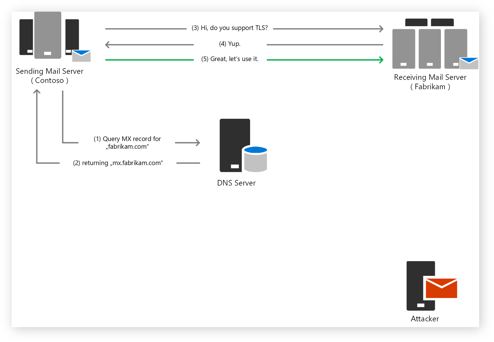
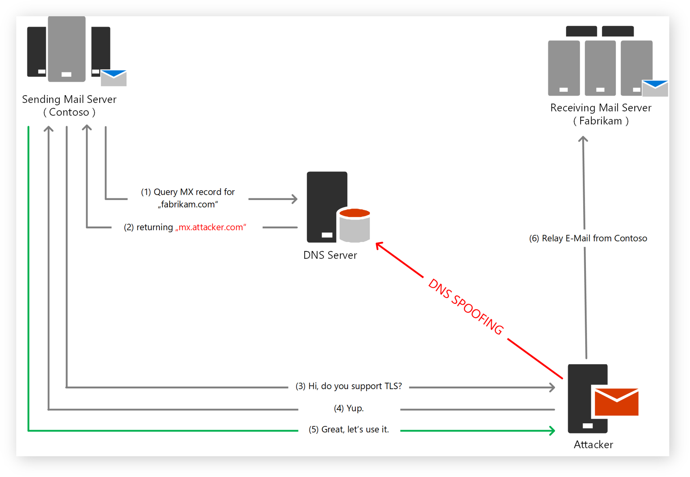
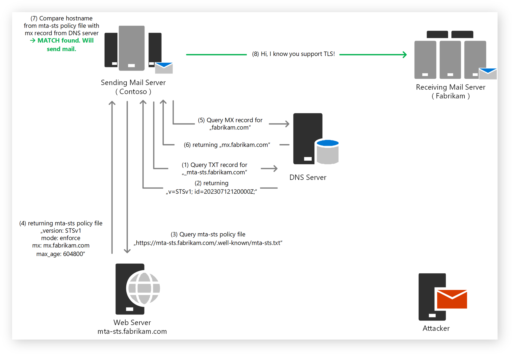
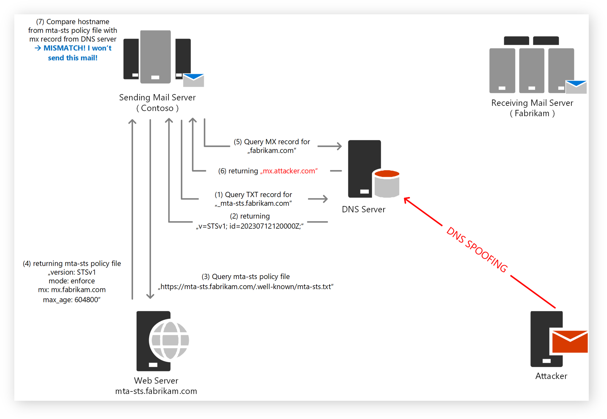

# MTA-STS Infographic

How does MTA-STS work? What are the benefits of MTA-STS? How can you deploy MTA-STS for your domain? Check out our visualized MTA-STS Infographic to learn more. This is a simple illustration of how MTA-STS works to give you a better understanding of the technology.

## Usual mailflow without MTA-STS

1. Sending server from 'Contoso' looks up the MX record for the recipient domain 'fabrikam.com' in DNS server.
2. DNS server returns the MX record for 'fabrikam.com' pointing to 'mx.fabrikam.com'.
3. Sending server connects to 'mx.fabrikam.com' and asks, if it supports STARTTLS.
4. 'mx.fabrikam.com' responds with '250 STARTTLS' to indicate that it supports STARTTLS.
5. Sending server starts TLS negotiation with 'mx.fabrikam.com'.

### Possible attack scenario without MTA-STS

1. Sending server from 'Contoso' looks up the MX record for the recipient domain 'fabrikam.com' in DNS server.
2. DNS server returns the MX record, which has been manipulated by an attacker, pointing to 'mx.attacker.com'.
3. Sending server connects to 'mx.attacker.com' and asks, if it supports STARTTLS.
4. 'mx.attacker.com' responds with '250 STARTTLS' to indicate that it supports STARTTLS.
5. Sending server starts TLS negotiation with 'mx.attacker.com'.
6. Attacker can now read, manipulate and even relay the email traffic between 'Contoso' and 'Fabrikam' without being noticed.

## Usual mailflow with MTA-STS

1. Sending server from 'Contoso' looks up the TXT record for the recipient domain 'fabrikam.com', which is predefined as '_mta-sts.fabrikam.com' in DNS server.
2. DNS server returns the TXT record for '_mta-sts.fabrikam.com' pointing to 'v=STSv1; id=20230712120000Z;', indicating that 'fabrikam.com' supports MTA-STS.
3. Sending server queries the MTA-STS Policy for 'fabrikam.com' at 'https://mta-sts.fabrikam.com/.well-known/mta-sts.txt'.
4. 'fabrikam.com' responds with the MTA-STS Policy, which indicates that MTA-STS is enforced and the email traffic should be sent to 'mx.fabrikam.com'.
5. Sending server from 'Contoso' looks up the MX record for the recipient domain 'fabrikam.com' in DNS server.
6. DNS server returns the MX record for 'fabrikam.com' pointing to 'mx.fabrikam.com'.
7. Sending server compares the MX record with the MTA-STS Policy and validates the match.
8. Sending server connects to 'mx.fabrikam.com' securely right from the beginning.

## Possible attack scenario with MTA-STS, which can be detected and mitigated

1. Sending server from 'Contoso' looks up the TXT record for the recipient domain 'fabrikam.com', which is predefined as '_mta-sts.fabrikam.com' in DNS server.
2. DNS server returns the TXT record for '_mta-sts.fabrikam.com' pointing to 'v=STSv1; id=20230712120000Z;', indicating that 'fabrikam.com' supports MTA-STS.
3. Sending server queries the MTA-STS Policy for 'fabrikam.com' at 'https://mta-sts.fabrikam.com/.well-known/mta-sts.txt'.
4. 'fabrikam.com' responds with the MTA-STS Policy, which indicates that MTA-STS is enforced and the email traffic should be sent to 'mx.fabrikam.com'.
5. Sending server looks up the MX record for the recipient domain 'fabrikam.com' in DNS server.
6. DNS server returns the MX record, which has been manipulated by an attacker, pointing to 'mx.attacker.com'.
7. Sending server compares the MX record with the MTA-STS Policy and detects a mismatch.
8. Sending server aborts the connection and reports the mismatch to the domain owner.

## Conclusion

You see, MTA-STS is a simple and effective way to prevent man-in-the-middle attacks on email traffic. By deploying MTA-STS for your domain, you can ensure that your email messages are delivered securely and reliably. If you want to learn more about MTA-STS, check out our [MTA-STS FAQ](./faq.md) or visit the official [RFC8461](https://tools.ietf.org/html/rfc8461) page. Start your deployment today and enhance the security of your mail flow with [PS.MTA-STS](../docs/deployFunctionApp.md).
